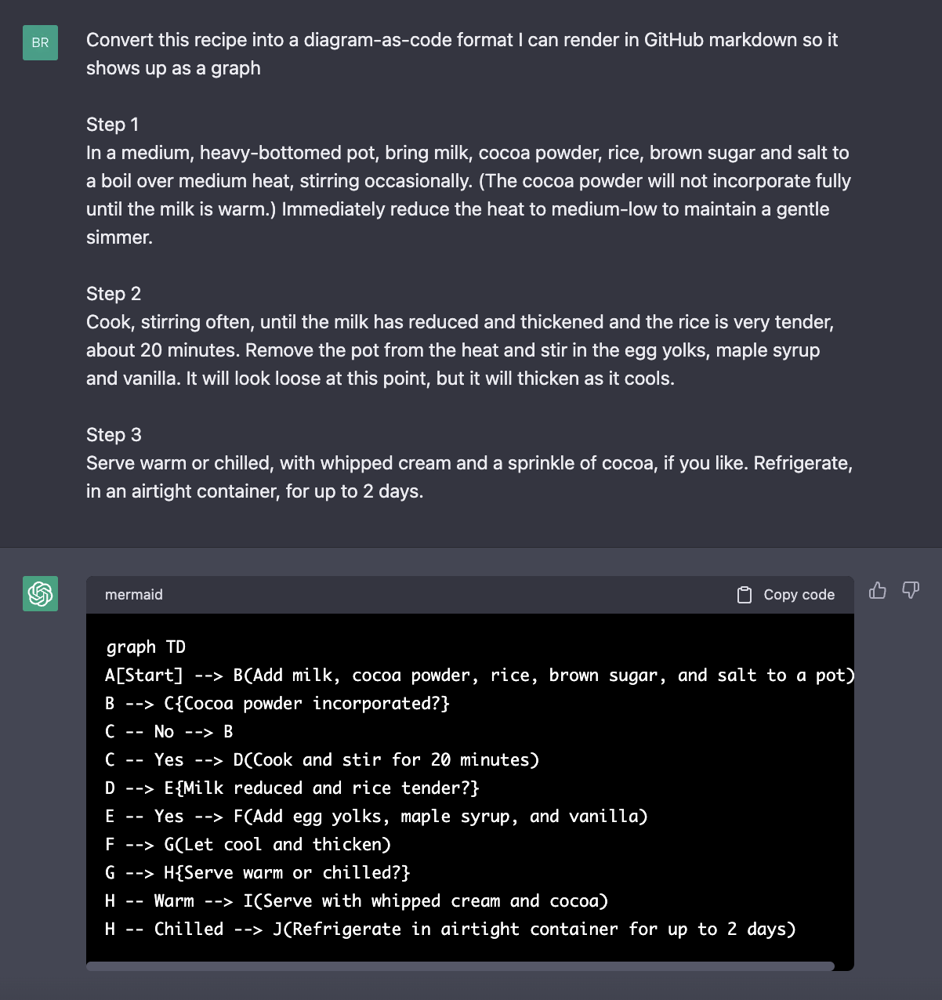
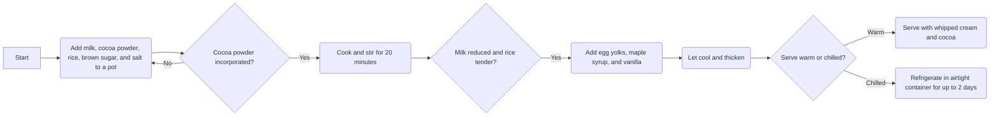

# Asking ChatGPT for help visualizing a Recipe

Recipe: https://cooking.nytimes.com/recipes/1023893-chocolate-rice-pudding

## Prompt 1: Create visual diagram

Code in screenshot

## Prompt 2: Make animation with Python manim

Request

    ok, now I'd like to make a youtube video and I'd like to use Python library manim to animate this recipe.  Write me the code for that

Response (see file [recipe_manim.py](recipe_manim.py)

## Prompt 3: How to run the manim code?

(note, after running this, the output is complete garbage :rofl: - but still pretty cool it can somewhat get this started)

Request

    how do I run that code?

Response

    To run the code, you'll need to have Manim installed on your machine. Here are the steps to do that:

      1. Install Python 3.7 or higher, if you don't already have it installed.
      2. Open a terminal window and run pip install manim.
      3. Create a new Python file, for example recipe_animation.py, and copy the code I provided earlier into it.
      4. In the terminal, navigate to the directory where your Python file is located.
      5. Run the command manim recipe_animation.py -pql, where recipe_animation.py is the name of your Python file. This will generate a video file named media/videos/recipe_animation.mp4 in the same directory.
      6. You can customize the output video by modifying the command line options. For example, you can change the video quality by specifying a different renderer (-r) or frame rate (-fps). You can also change the resolution (-s) or background color (-bg). You can find more information about the available options in the Manim documentation.